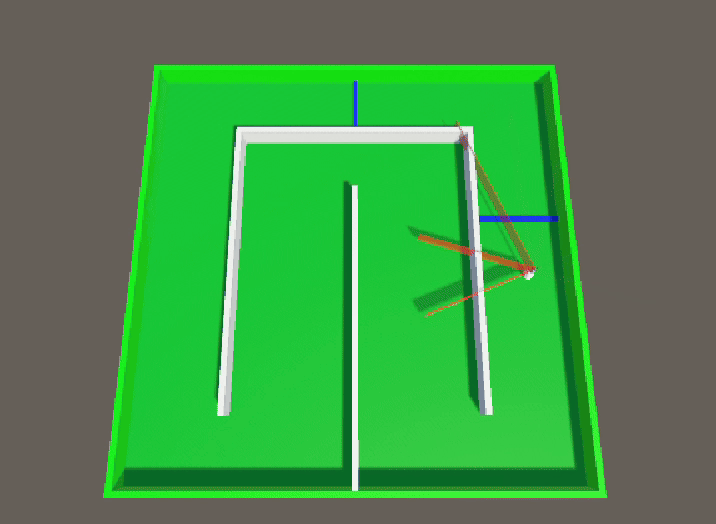

# 🏎️🤖 Unity AI Learning to Drive on a Race Circuit with PPO Reinforcement Learning

  
  

## 📝 Project Description
This project demonstrates **Reinforcement Learning** using **PPO (Proximal Policy Optimization)** in **Unity 3D** to train an AI agent to drive around a race circuit.  
The character learns car-like movement (forward, backward, turn left, turn right) using a **vision-based system** to navigate through checkpoints and complete laps through trial and error.

⚡️ Essentially, the AI learns racing skills autonomously by seeing the track and being rewarded for passing checkpoints and completing laps!

---

## ⚙️ Features

🧠 **PPO Reinforcement Learning** — State-of-the-art algorithm for training intelligent agents.  

👁️ **Vision-Based System** — Agent uses visual perception to understand the track and navigate.  

🚗 **Car-like Controls** — Agent learns realistic driving mechanics (forward, backward, left turn, right turn).  

🏁 **Checkpoint System** — Progress tracked through multiple checkpoints around the circuit.  

🎮 **Unity ML-Agents** — Leverages Unity's machine learning framework for 3D environments.  

🔄 **Lap Completion** — Agent learns to complete full circuit laps by reaching all checkpoints in order.  

📊 **Performance Tracking** — Monitors checkpoint progress and lap completion.

---

## 📊 Example Outputs

### Trained Agent Performance

**Circuit Navigation:**

  

### Learning Challenges
During training, the agent learns from mistakes such as wall collisions and track deviations:

**Misaligned AI by crossing walls:**

  

### 3D Character Model
Custom Templar character model I created for this project (I wanted to create a model I can use for differente projects. I started with a chess pown, then a animal but I wanted a model without any need of movement so I made a Templar with different color to make team):

  
  

---

## 🧠 Training Visualization

The training process shows the agent learning to navigate the circuit:
- **Character agent** = AI-controlled entity learning to race  
- **Checkpoints** = Sequential targets to reach for lap completion  
- **Vision rays** = Visual perception system for track detection  
- **Circuit track** = Racing environment with curves and straightaways

As training progresses, the agent transitions from making frequent errors (wall collisions, missing checkpoints) to smooth, efficient driving. The vision-based system allows it to perceive track boundaries and adapt its racing line accordingly.

---

## ⚙️ How it Works

1. 🎬 **Environment Reset** → Agent spawns at the starting position on the circuit.  
2. 👁️ **Visual Observation** → The agent perceives the track through vision rays detecting track boundaries and checkpoints.  
3. 🤖 **State Information** → Agent processes its speed, rotation, and current checkpoint progress.  
4. 🧠 **Decision** → PPO algorithm decides driving actions (forward/backward, turn left/right) based on visual input and current policy.  
5. 🚗 **Action & Movement** → Agent performs car-like movements to navigate the circuit.  
6. 🏁 **Checkpoint Rewards** → Agent receives positive rewards for passing checkpoints in the correct order.  
7. 🔄 **Learning** → Neural network updates based on accumulated racing experiences.  
8. ✅ **Lap Completion** → Agent learns to complete full laps by reaching all checkpoints sequentially.

The vision-based approach allows the agent to learn track features and adapt its driving strategy accordingly.

---

## 🧰 Components

| Component | Description |
|-----------|-------------|
| 🏎️ **Agent (Character)** | AI-controlled entity learning car-like driving on a circuit |
| 👁️ **Vision System** | Ray-based perception for detecting track boundaries and environment |
| 🏁 **Checkpoint System** | Sequential waypoints marking progress around the circuit |
| 🛣️ **Race Circuit** | Track environment with curves, straights, and boundaries |
| 🧠 **PPO Algorithm** | Reinforcement learning algorithm optimizing racing behavior |
| 🎮 **Car Controls** | Forward, backward, turn left, turn right actions |
| 📊 **Lap Counter** | Tracks checkpoint progress and completed laps |
| ⏱️ **Time/Episode Limit** | Constraint for completing the circuit |

---

## 🚀 Getting Started

### Prerequisites
- Unity 2020.3 or later
- Unity ML-Agents Toolkit
- Python 3.7+ (for ML-Agents training)

### Installation
1. Clone this repository
2. Open the project in Unity
3. Install ML-Agents package via Package Manager
4. Configure training parameters in the YAML config file
5. Run training using `mlagents-learn` command

### Training Tips
- Adjust vision ray count and distance for optimal track perception
- Balance rewards between checkpoint progression and lap completion
- Fine-tune penalty for going off-track or wrong direction
- Experiment with different circuit layouts for varied training

---

## 📖 Inspiration / Sources  

This project uses Unity's ML-Agents framework for reinforcement learning:
- [Unity ML-Agents Documentation](https://github.com/Unity-Technologies/ml-agents)
- [PPO Algorithm Paper](https://arxiv.org/abs/1707.06347)
- [Ray Perception Sensor Documentation](https://github.com/Unity-Technologies/ml-agents/blob/main/docs/Learning-Environment-Design-Agents.md#raycast-observations)

Project created by me 😎, Thibault GAREL - [Github](https://github.com/Thibault-GAREL)
